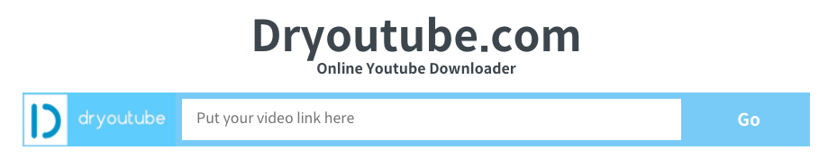

# youtube-download-service

A youtube video downloading online service codebase built with golang and react.js.

## Using
The service website is here: https://dryoutube.com (currently shut down)

## Deploying
This repository assumes you use Google Cloud Storage (GCS) and was originally deployed on GCP Cloud Run.

Therefore, You need GCP resources and credentials to run the codebase.

The commands for deployment can be found in makefile in backend and frontend directories.
